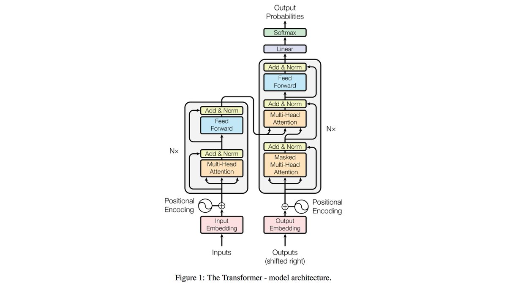
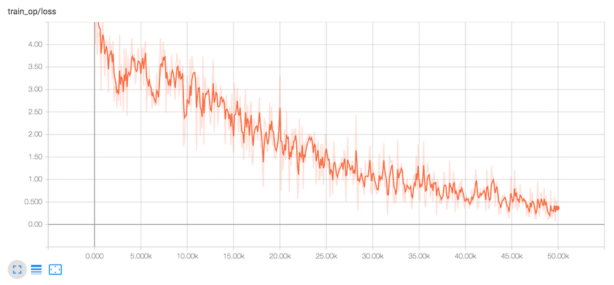

# transformer

TensorFlow implementation of [Attention Is All You Need](https://arxiv.org/abs/1706.03762). (2017. 6)




## Requirements

- Python 3.6
- TensorFlow 1.4
- [hb-config](https://github.com/hb-research/hb-config) (Singleton Config)
- nltk (tokenizer)
- tqdm (progress bar)


## Project Structure

    .
    ├── config                  # Config files (.yml, .json) using with hb-config
    ├── transformer             # transformer architecture graphs (from input to logits)
    ├── data_loader.py          # raw_date -> precossed_data -> generate_batch (using Dataset)
    ├── hook.py                 # training or test hook feature (eg. print_variables)
    ├── main.py                 # define experiment_fn
    └── model.py                # define EstimatorSpec      

Reference : [hb-config](https://github.com/hb-research/hb-config), [Dataset](https://www.tensorflow.org/api_docs/python/tf/data/Dataset#from_generator), [experiments_fn](https://www.tensorflow.org/api_docs/python/tf/contrib/learn/Experiment), [EstimatorSpec](https://www.tensorflow.org/api_docs/python/tf/estimator/EstimatorSpec)

## Todo

- Implements Multi-Head masked opt
- Implements Eval flow (need recursive process) with BLEU
- Make English-Korean Corpus based on [Cornell\_Movie\-Dialogs\_Corpus](https://www.cs.cornell.edu/~cristian/Cornell_Movie-Dialogs_Corpus.html)


## Config

Can control all **Experimental environment**.

example: check_tiny.yml

```yml
data:
  processed_path: 'tiny_processed_data'
  max_seq_length: 20
  word_threshold: 1

  PAD_ID: 0
  UNK_ID: 1
  START_ID: 2
  EOS_ID: 3

model:
  num_layers: 1
  model_dim: 16
  num_heads: 1
  linear_key_dim: 10
  linear_value_dim: 10
  ffn_dim: 16
  dropout: 0.2

train:
  batch_size: 2
  learning_rate: 0.00001
  train_steps: 50000
  model_dir: 'logs/check_tiny'
  save_checkpoints_steps: 1000
  check_hook_n_iter: 100
  min_eval_frequency: 100
  optimizer: 'Adam'  ('Adagrad', 'Adam', 'Ftrl', 'Momentum', 'RMSProp', 'SGD')

eval:
  batch_size: -1   (Using all test data)
```

## Usage

Install requirements.

```pip install -r requirements.txt```

Then, start train and evalueate model
```
python main.py --config check_tiny --mode train
```

### Experiments modes

- `evaluate` : Evaluate on the evaluation data.
- `extend_train_hooks` : Extends the hooks for training.
- `reset_export_strategies` : Resets the export strategies with the new_export_strategies.
- `run_std_server` : Starts a TensorFlow server and joins the serving thread.
- `test` : Tests training, evaluating and exporting the estimator for a single step.
- `train` : Fit the estimator using the training data.
- `train_and_evaluate` : Interleaves training and evaluation.

---

### Tensorboar

```tensorboard --logdir logs```

- check-tiny example




## Reference

- [hb-research/notes - Attention Is All You Need](https://github.com/hb-research/notes)
- [Attention Is All You Need](https://arxiv.org/abs/1706.03762) (2017. 6) by A Vaswani (Google Brain Team)
- [tensor2tensor](https://github.com/tensorflow/tensor2tensor) - A library for generalized sequence to sequence models (official code)

## Author

Dongjun Lee (humanbrain.djlee@gmail.com)
