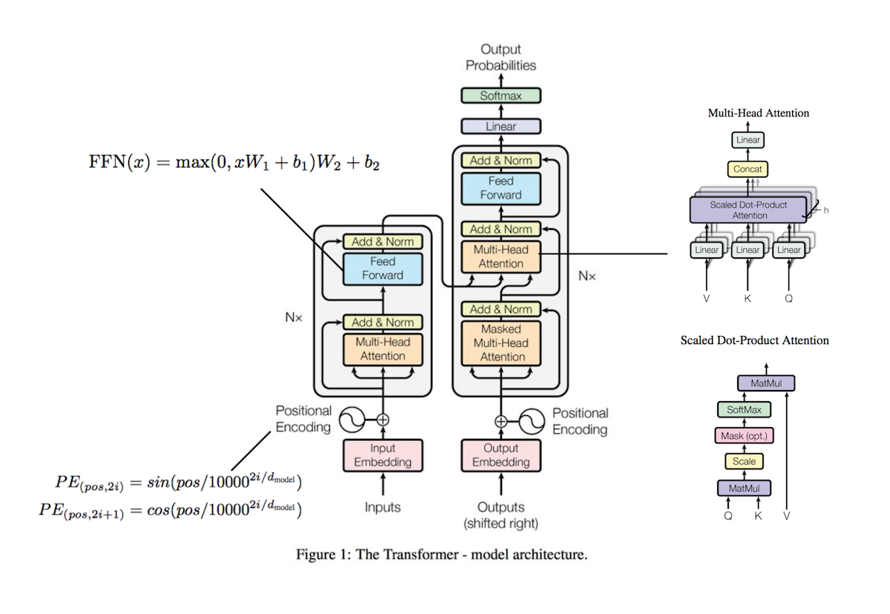
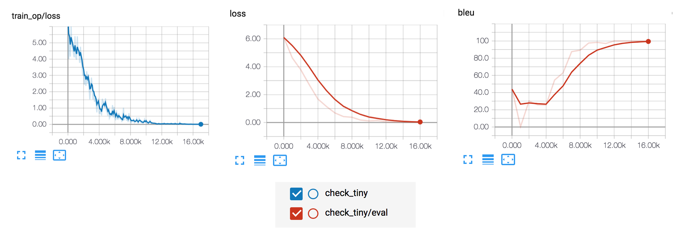

# transformer [](https://github.com/hb-research)

TensorFlow implementation of [Attention Is All You Need](https://arxiv.org/abs/1706.03762). (2017. 6)



## Requirements

- Python 3.6
- TensorFlow 1.8
- [hb-config](https://github.com/hb-research/hb-config) (Singleton Config)
- nltk (tokenizer and blue score)
- tqdm (progress bar)
- [Slack Incoming Webhook URL](https://my.slack.com/services/new/incoming-webhook/)


## Project Structure

init Project by [hb-base](https://github.com/hb-research/hb-base)

    .
    ├── config                  # Config files (.yml, .json) using with hb-config
    ├── data                    # dataset path
    ├── notebooks               # Prototyping with numpy or tf.interactivesession
    ├── transformer             # transformer architecture graphs (from input to logits)
        ├── __init__.py             # Graph logic
        ├── attention.py            # Attention (multi-head, scaled_dot_product and etc..)
        ├── encoder.py              # Encoder logic
        ├── decoder.py              # Decoder logic
        └── layer.py                # Layers (FFN)
    ├── data_loader.py          # raw_date -> precossed_data -> generate_batch (using Dataset)
    ├── hook.py                 # training or test hook feature (eg. print_variables)
    ├── main.py                 # define experiment_fn
    └── model.py                # define EstimatorSpec

Reference : [hb-config](https://github.com/hb-research/hb-config), [Dataset](https://www.tensorflow.org/api_docs/python/tf/data/Dataset#from_generator), [experiments_fn](https://www.tensorflow.org/api_docs/python/tf/contrib/learn/Experiment), [EstimatorSpec](https://www.tensorflow.org/api_docs/python/tf/estimator/EstimatorSpec)

## Todo

- Train and evaluate with 'WMT German-English (2016)' dataset

## Config

Can control all **Experimental environment**.

example: check-tiny.yml

```yml
data:
  base_path: 'data/'
  raw_data_path: 'tiny_kor_eng'
  processed_path: 'tiny_processed_data'
  word_threshold: 1

  PAD_ID: 0
  UNK_ID: 1
  START_ID: 2
  EOS_ID: 3

model:
  batch_size: 4
  num_layers: 2
  model_dim: 32
  num_heads: 4
  linear_key_dim: 20
  linear_value_dim: 24
  ffn_dim: 30
  dropout: 0.2

train:
  learning_rate: 0.0001
  optimizer: 'Adam'  ('Adagrad', 'Adam', 'Ftrl', 'Momentum', 'RMSProp', 'SGD')
  
  train_steps: 15000
  model_dir: 'logs/check_tiny'
  
  save_checkpoints_steps: 1000
  check_hook_n_iter: 100
  min_eval_frequency: 100
  
  print_verbose: True
  debug: False
  
slack:
  webhook_url: ""  # after training notify you using slack-webhook
```

* debug mode : using [tfdbg](https://www.tensorflow.org/programmers_guide/debugger)
* `check-tiny` is a data set with about **30 sentences** that are translated from Korean into English. (recommend read it :) )

## Usage

Install requirements.

```pip install -r requirements.txt```

Then, pre-process raw data.

```python data_loader.py --config check-tiny```

Finally, start train and evaluate model

```python main.py --config check-tiny --mode train_and_evaluate```


Or, you can use [IWSLT'15 English-Vietnamese](https://nlp.stanford.edu/projects/nmt/) dataset.

```
sh prepare-iwslt15.en-vi.sh                                        # download dataset
python data_loader.py --config iwslt15-en-vi                       # preprocessing
python main.py --config iwslt15-en-vi --mode train_and_evalueate   # start training
```

### Predict

After training, you can test the model.

- command

```bash
python predict.py --config {config} --src {src_sentence}
```

- example

```bash
$ python predict.py --config check-tiny --src "안녕하세요. 반갑습니다."

------------------------------------
Source: 안녕하세요. 반갑습니다.
 > Result: Hello . I'm glad to see you . <\s> vectors . <\s> Hello locations . <\s> will . <\s> . <\s> you . <\s>
```


### Experiments modes

:white_check_mark: : Working  
:white_medium_small_square: : Not tested yet.


- :white_check_mark: `evaluate` : Evaluate on the evaluation data.
- :white_medium_small_square: `extend_train_hooks` :  Extends the hooks for training.
- :white_medium_small_square: `reset_export_strategies` : Resets the export strategies with the new_export_strategies.
- :white_medium_small_square: `run_std_server` : Starts a TensorFlow server and joins the serving thread.
- :white_medium_small_square: `test` : Tests training, evaluating and exporting the estimator for a single step.
- :white_check_mark: `train` : Fit the estimator using the training data.
- :white_check_mark: `train_and_evaluate` : Interleaves training and evaluation.

---

### Tensorboar

```tensorboard --logdir logs```

- check-tiny example




## Reference

- [hb-research/notes - Attention Is All You Need](https://github.com/hb-research/notes/blob/master/notes/transformer.md)
- [Paper - Attention Is All You Need](https://arxiv.org/abs/1706.03762) (2017. 6) by A Vaswani (Google Brain Team)
- [tensor2tensor](https://github.com/tensorflow/tensor2tensor) - A library for generalized sequence to sequence models (official code)

## Author

Dongjun Lee (humanbrain.djlee@gmail.com)
